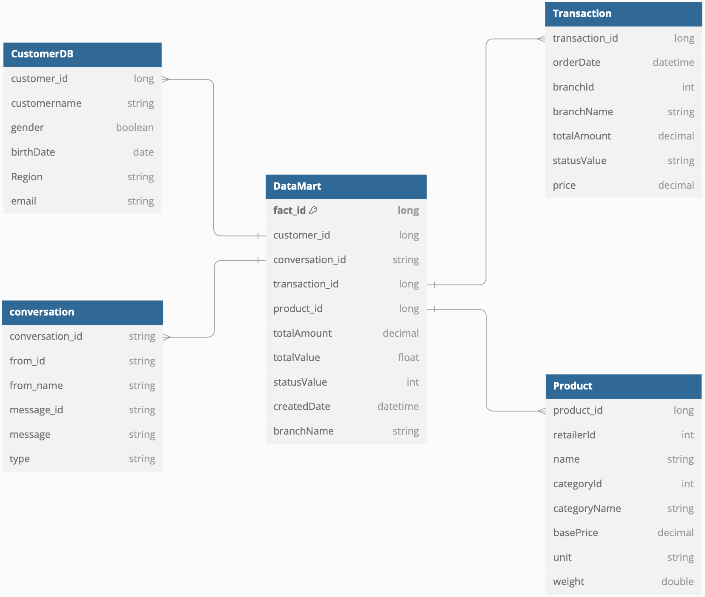
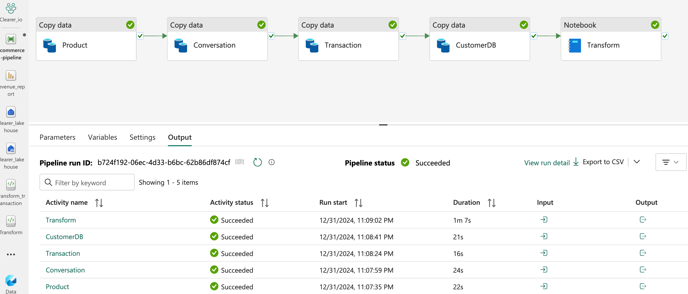
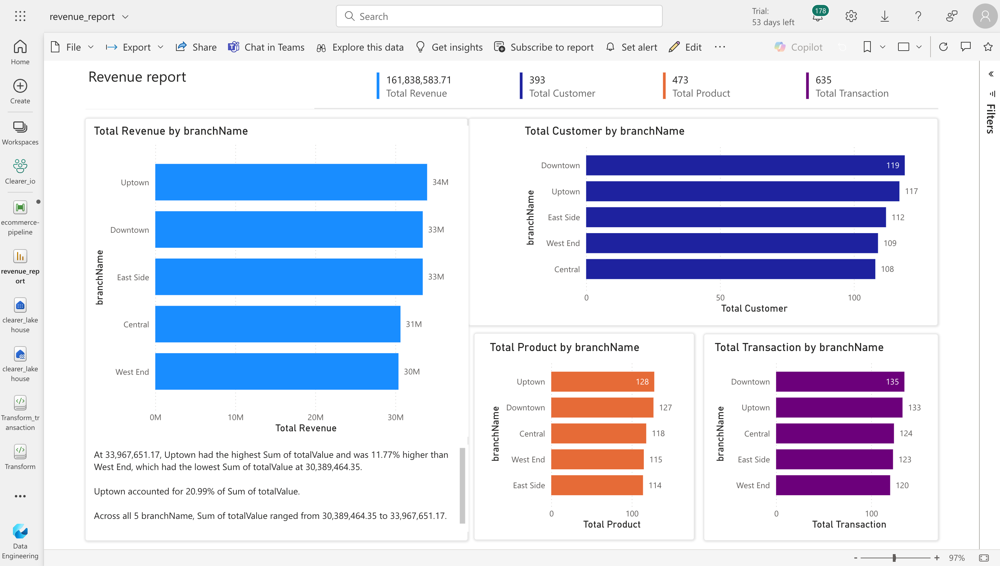

### 2. Challenges and Solutions in Multi-Region Data Migration to a Data Warehouse (DWH)

#### Timezone Differences Across Regions:
- **Problem:** Timezone differences can cause inconsistencies in time-sensitive data, leading to errors in reporting, analytics, and scheduling jobs.
- **Solution:** Carefully verify the timezone of data fetched from new regions. Convert all timestamps to UTC if not already standardized. After processing, create timezone-specific views for end-users based on the requirements of different applications.

#### Data Format and Structural Differences:
- **Problem:** Variations in data formats and model structures across regions can lead to integration issues and potential data loss.
- **Solution:** Verify and transform data to align with the DWH's existing format. Ensure robust data validation and transformation processes to avoid loss or corruption during migration.

#### Latency and Data Synchronization:
- **Problem:** Migrating data across regions may introduce latency, impacting real-time reporting and synchronization between systems.
- **Solution:** Position servers strategically based on customer locations. Utilize cloud providers' edge locations (small data centers distributed globally) to cache data and reduce latency for better real-time performance.

#### Cost Management:
- **Problem:** Operating cross-region servers can incur high costs due to data transfer and resource usage.
- **Solution:** Leverage cost-efficient regions for hosting services, as pricing varies between cloud regions. Evaluate and balance cost savings against latency to ensure an optimal solution.

#### Compliance with Local Regulations:
- **Problem:** Some countries mandate that customer data from their region must be stored within their borders, necessitating compliance with local laws.
- **Solution:** Host servers within the respective countries to meet regulatory requirements while maintaining secure and compliant data handling processes.

### 3. Data Transformation Metrics**
This section outlines the key metrics extracted and transformed from the dataset using **Python**

#### 1. Lifespan of Each Store** 
- Calculate the operational **lifespan** of each store.  
- If the parameter `toNow` is set to **`True`**, the lifespan will be calculated **up to the current date**.  

```
lifespan = df_datasample.groupBy('store_id').agg(
    min(to_date(col('fromDate'))).alias('startDate'),
    max(to_date(col('toDate'))).alias('endDate'),
    datediff(max(to_date(col('toDate'))),min(to_date(col('fromDate'))).alias('endDate')).alias('lifespan_in_active')
)
```

**Result:**

```
+----------+----------+----------+------------------+
|  store_id| startDate|   endDate|lifespan_in_active|
+----------+----------+----------+------------------+
|Store_5407|2022-05-30|2025-01-01|               947|
|Store_5125|2022-05-23|2023-03-07|               288|
|Store_4938|2022-05-17|2025-01-01|               960|
|Store_5390|2022-05-30|2025-01-01|               947|
|Store_5168|2022-05-24|2023-08-31|               464|
|Store_4960|2022-05-17|2025-01-01|               960|
|Store_4719|2022-05-10|2025-01-01|               967|
|Store_4435|2022-04-30|2025-01-01|               977|
|Store_5133|2022-05-23|2022-06-17|                25|
|Store_5067|2022-05-19|2025-01-01|               958|
|Store_4984|2022-05-18|2022-11-01|               167|
|Store_4882|2022-05-15|2022-05-17|                 2|
|Store_4779|2022-05-11|2025-01-01|               966|
|Store_4726|2022-05-10|2022-07-09|                60|
|Store_5315|2022-05-27|2025-01-01|               950|
|Store_4902|2022-05-16|2022-05-16|                 0|
|Store_4720|2022-05-10|2022-10-13|               156|
|Store_4683|2022-05-09|2022-05-10|                 1|
|Store_4687|2022-05-09|2025-01-01|               968|
|Store_4632|2022-05-06|2025-01-01|               971|
+----------+----------+----------+------------------+
only showing top 20 rows
```
