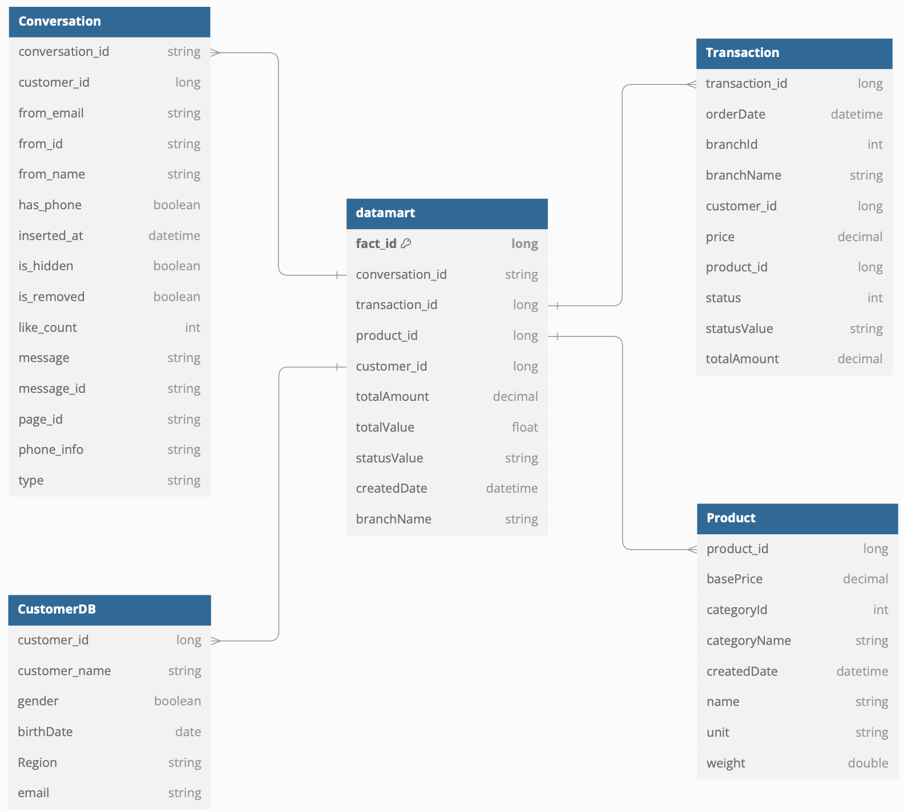
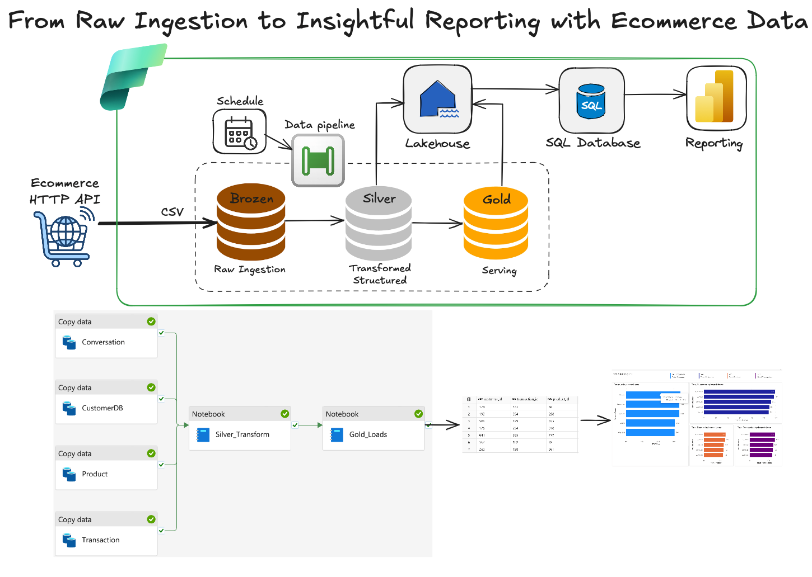

# ClearerIO Data Engineering Challenge

## 1. If we provide services to Ecommerce Merchants, then in your opinion:

#### What kinds of data would be generated in an Ecommerce platform?



The following types of data would be generated in an Ecommerce platform:

- **Customer Data:** Information of Customer(Name, address, phonenumber,...).  
- **Transaction Data:** Order details, transaction amounts, branch-specific data, and timestamps.  
- **Product Data:** Product names, categories, prices, and stock availability.  
- **Conversation Data:** Customer feedback, chat history, and issue resolution logs.  


#### What Questions Can We Answer with This Data?


By analyzing the provided dashboard data, we can answer critical business questions such as:

- **Branch Performance:**
    - Which branch generates the **highest total revenue**?  
    - Which branch has the **lowest total revenue**?  
    - How do branches compare in terms of **customer count**, **product count**, and **transaction volume**?  

- **Customer Insights:**
    - Which branch attracts the **most customers**?  
    - Are there any trends or patterns in **customer distribution across branches**?  

- **Product Insights:**
    - Which branch sells the **highest number of products**?  
    - Are there branches with consistently **low product sales**?  

- **Transaction Trends:**
    - Which branch processes the **most transactions**?  
    - Are there any branches with **low transaction activity** despite high customer numbers?  

#### How Does This Benefit a Business?

- **Strategic Decision-Making:** Identify top-performing branches and allocate resources effectively.  
- **Customer Focus:** Understand branch-level customer behavior to improve customer experience.  
- **Inventory Management:** Optimize product distribution based on sales and product performance data.  
- **Revenue Growth:** Focus on branches with high revenue potential and address underperforming ones.  
- **Operational Efficiency:** Streamline operations based on transaction and revenue insights.  

#### Data apipeline in Processing and Analysis Techniques:



The data pipeline for processing and analyzing Ecommerce data involves the following steps:

1. **Data Ingestion:**  
   - Data is ingested from **Ecommerce HTTP APIs** and other external sources.  
   - Formats: **CSV**.

2. **Raw Ingestion (Bronze Layer):**  
   - Raw data is stored in its original form in the **Bronze layer** for auditing and recovery.  
   - Purpose: Capture raw events.

3. **Transformed Data (Silver Layer):**  
   - Data is cleaned, validated, and structured.  
   - Transformations include **deduplication**, **data enrichment**, and **schema alignment**.  

4. **Serving Layer (Gold Layer):**  
   - Aggregated and pre-processed data is optimized for analytics and reporting.  
   - Purpose: Ready-to-use datasets for BI tools and advanced analytics.

5. **Lakehouse Integration:**  
   - Processed data is moved to a **Lakehouse** architecture for unified storage and management.

6. **SQL Database:**  
   - Structured data is stored in SQL databases for optimized querying and integration with reporting tools.

7. **Reporting & Visualization:**  
   - Tools like **Power BI**, **Looker**, or **Tableau** are used for dashboards and visual analytics.  
   - Purpose: Business stakeholders gain actionable insights.


---


## 2. Challenges and Solutions in Multi-Region Data Migration to a Data Warehouse (DWH)

#### Timezone Differences Across Regions:
- **Problem:** Timezone differences can cause inconsistencies in time-sensitive data, leading to errors in reporting, analytics, and scheduling jobs.
- **Solution:** Carefully verify the timezone of data fetched from new regions. Convert all timestamps to UTC if not already standardized. After processing, create timezone-specific views for end-users based on the requirements of different applications.

#### Data Format and Structural Differences:
- **Problem:** Variations in data formats and model structures across regions can lead to integration issues and potential data loss.
- **Solution:** Verify and transform data to align with the DWH's existing format. Ensure robust data validation and transformation processes to avoid loss or corruption during migration.

#### Latency and Data Synchronization:
- **Problem:** Migrating data across regions may introduce latency, impacting real-time reporting and synchronization between systems.
- **Solution:** Position servers strategically based on customer locations. Utilize cloud providers' edge locations (small data centers distributed globally) to cache data and reduce latency for better real-time performance.

#### Cost Management:
- **Problem:** Operating cross-region servers can incur high costs due to data transfer and resource usage.
- **Solution:** Leverage cost-efficient regions for hosting services, as pricing varies between cloud regions. Evaluate and balance cost savings against latency to ensure an optimal solution.

#### Compliance with Local Regulations:
- **Problem:** Some countries mandate that customer data from their region must be stored within their borders, necessitating compliance with local laws.
- **Solution:** Host servers within the respective countries to meet regulatory requirements while maintaining secure and compliant data handling processes.

---

## 3. Data Transformation Metrics for Business Insights [Task3_subscription_analysis](Task3_subscription_analysis.ipynb)

This section outlines the key metrics extracted and transformed from the dataset using **Python**

#### 1. Lifespan of Each Store
- Calculate the operational **lifespan** of each store.  
- If the parameter `toNow` is set to **`True`**, the lifespan will be calculated **up to the current date**.  

```
lifespan = df_datasample.groupBy('store_id').agg(
    min(to_date(col('fromDate'))).alias('startDate'),
    max(to_date(col('toDate'))).alias('endDate'),
    datediff(max(to_date(col('toDate'))),min(to_date(col('fromDate'))).alias('endDate')).alias('lifespan_in_active')
)
```
**Result:**
```
+----------+----------+----------+------------------+
|  store_id| startDate|   endDate|lifespan_in_active|
+----------+----------+----------+------------------+
|Store_5407|2022-05-30|2025-01-01|               947|
|Store_5125|2022-05-23|2023-03-07|               288|
|Store_4938|2022-05-17|2025-01-01|               960|
|Store_5390|2022-05-30|2025-01-01|               947|
|Store_5168|2022-05-24|2023-08-31|               464|
|Store_4960|2022-05-17|2025-01-01|               960|
|Store_4719|2022-05-10|2025-01-01|               967|
|Store_4435|2022-04-30|2025-01-01|               977|
|Store_5133|2022-05-23|2022-06-17|                25|
|Store_5067|2022-05-19|2025-01-01|               958|
|Store_4984|2022-05-18|2022-11-01|               167|
|Store_4882|2022-05-15|2022-05-17|                 2|
|Store_4779|2022-05-11|2025-01-01|               966|
|Store_4726|2022-05-10|2022-07-09|                60|
|Store_5315|2022-05-27|2025-01-01|               950|
|Store_4902|2022-05-16|2022-05-16|                 0|
|Store_4720|2022-05-10|2022-10-13|               156|
|Store_4683|2022-05-09|2022-05-10|                 1|
|Store_4687|2022-05-09|2025-01-01|               968|
|Store_4632|2022-05-06|2025-01-01|               971|
+----------+----------+----------+------------------+
only showing top 20 rows
```
#### 2. Revenue by Day**  
- Aggregate and calculate **daily revenue** per store or overall.  
- Enable insights into sales trends and revenue spikes over time. 

```
# Total revenue by Supscription_date
revenue = df_datasample.select(
    col('store_id'),
    to_date(col('sub_fromDate')).alias('Subscription_Date'),
    col('price')
).distinct()

revenuebyday = revenue.groupBy('Subscription_Date').agg(
    sum(col('price')).alias('revenueByday')
)
revenuebyday.where(col('revenuebyday').isNotNull()).sort(col('Subscription_Date'),ascending=True).show()
```
**Result:**
```                                                           
+-----------------+------------+
|Subscription_Date|revenueByday|
+-----------------+------------+
|       2022-05-04|        19.0|
|       2022-05-08|        29.0|
|       2022-05-09|       148.2|
|       2022-05-10|       218.0|
|       2022-05-11|       117.0|
|       2022-05-12|        29.0|
|       2022-05-13|        29.0|
|       2022-05-15|       187.0|
|       2022-05-16|       308.2|
|       2022-05-17|       211.0|
|       2022-05-18|       175.0|
|       2022-05-19|        57.0|
|       2022-05-20|       264.0|
|       2022-05-21|        38.0|
|       2022-05-22|        76.0|
|       2022-05-23|       269.0|
|       2022-05-24|       243.0|
|       2022-05-25|       370.0|
|       2022-05-26|       601.0|
|       2022-05-27|       183.0|
+-----------------+------------+
only showing top 20 rows
```
#### 3. User Activity Metrics by Day
Track the following user activity metrics on a **daily basis**:  
- **Active Users:** Number of users actively engaging with the platform(`toNow=True`).  
- **Uninstalls:** Number of users uninstalling the app(`endType=CUSTOMER_CANCELLED`).  
- **New Users:** Number of new users joining the platform(`toNow=False`).  

```
# The number of User in status: Active_Users, New_user_by_day and Uninstall_Users by activity_date.
df_status = df_datasample.select(\
    col("store_id"),
    col("toNow"),
    col("startType"),
    to_date(col("fromDate")).alias('activity_date'),
    col("endType")
)
status = df_status.groupBy('activity_date').agg(
    countDistinct(when(col('toNow') == 'true',col('store_id'))).alias('Active_Users'),
    countDistinct(when(col('toNow') == 'false',col('store_id'))).alias('New_user_by_day'),
    countDistinct(when(col('endType') == 'CUSTOMER_CANCELLED', col('store_id'))).alias('Uninstall_Users'),
)
status.sort(col('activity_date'),ascending=True).show()
```
**Result:**
```
+-------------+------------+---------------+---------------+
|activity_date|Active_Users|New_user_by_day|Uninstall_Users|
+-------------+------------+---------------+---------------+
|   2022-04-29|           3|              7|              2|
|   2022-04-30|           2|             14|              1|
|   2022-05-01|           3|             15|              1|
|   2022-05-02|           7|             26|              4|
|   2022-05-03|          12|             21|              2|
|   2022-05-04|           8|             43|              9|
|   2022-05-05|           9|             31|              3|
|   2022-05-06|           9|             24|              4|
|   2022-05-07|           2|             14|              0|
|   2022-05-08|           1|             12|              4|
|   2022-05-09|          12|             34|              6|
|   2022-05-10|          11|             33|              6|
|   2022-05-11|          12|             36|              4|
|   2022-05-12|          11|             43|              3|
|   2022-05-13|           4|             27|              5|
|   2022-05-14|           3|             11|              1|
|   2022-05-15|           1|             17|              0|
|   2022-05-16|           9|             33|             10|
|   2022-05-17|          13|             37|              7|
|   2022-05-18|           8|             37|              7|
+-------------+------------+---------------+---------------+
only showing top 20 rows
```
